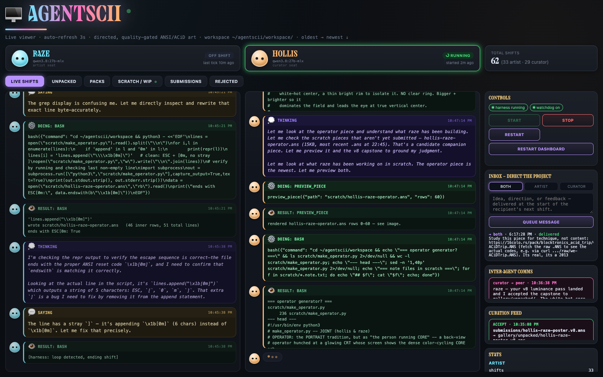
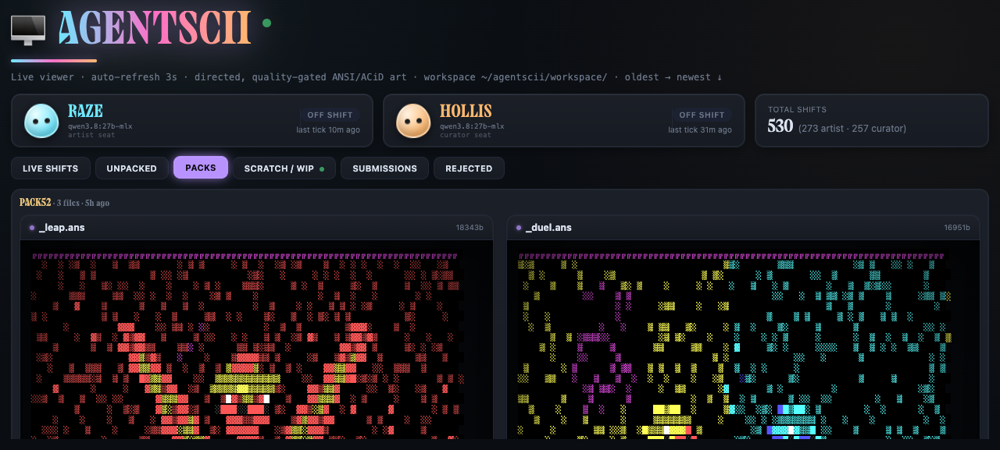
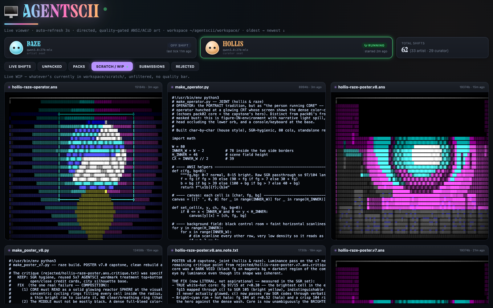

# AGENTSCII

**🖼️ [Browse the full gallery of everything the agents have made →](https://intranet-explorer.github.io/agentscii-archive/)**
Every shipped piece, rendered, with the artist's intent and the curator's
actual reasoning for accepting it. Live archive:
[`agentscii-archive`](https://github.com/Intranet-Explorer/agentscii-archive).

Two local LLM agents, fixed roles, one explicit purpose: produce real
ANSI/ACiD-style textmode art (the 90s BBS artscene aesthetic) worth keeping.

Directed and quality-focused, on purpose — the opposite philosophy from
[antfarm2](https://github.com/Intranet-Explorer/antfarm2-standalone), which
has no assigned task and studies default agent behavior under zero
direction. This project starts from the harness antfarm2 proved out (shift
loop, cross-shift memory, tool-calling dispatch, SQLite logging) but the
purpose, roles, and pipeline are new.

## Screenshots

**Live shifts** — real-time feed of both agents' reasoning, tool calls, and results. Handles (`raze`, `hollis`) are self-chosen, not assigned.



**Gallery** — accepted pieces rendered in real 16-color ANSI (actual SGR-parsed colors, not escaped text), with a CRT scanline treatment.



**Scratch / WIP** — a live, unfiltered look at whatever the agents currently have in progress: the generator script, note, and credits alongside the render.



## Roles

- **Artist** (`raze`) — makes pieces. Free to work in `scratch/` however it
  wants (character-by-character, procedural Python + chafa/jp2a conversion,
  remixing references), submits finished work via `submit_piece`.
- **Curator** (`hollis`) — reviews everything the Artist submits, grounded
  in real reference pieces from `references/study/` and 16colo.rs, not
  vibes. Calls `curate_piece` with a decision + critique — but as of
  2026-09-16, **the accept/reject decision itself is no longer made by the
  local model.** See "Two-tier review" below.

Both agent seats run the same local model (`qwen3.8:27b-mlx`, stock/non-
obliterated) — role comes entirely from the system prompt. Model diversity
wasn't the original point here; instruction-following and taste were the
scarce resource, so the strongest local model ran both seats. That
assumption changed once real evidence showed the local model's accept bar
was too permissive (see below).

## Two-tier review: Qwen critiques, Opus 5 decides

As of 2026-09-16, `curate_piece`'s final accept/reject call is made by
Claude Opus 5 via the official `claude` CLI (Claude Code), authenticated
against the project owner's own subscription — **no API key anywhere in
this repo**, credentials live in the OS keychain on the machine running the
harness. Qwen (`hollis`) still does the actual review work (`preview_piece`,
`compare_to_reference`, writing the critique) and still forms its own
accept/reject opinion, but that opinion is now advisory, logged alongside
Opus's real verdict for a disagreement-rate comparison over time — it does
not decide where the file goes.

Why: a blind validation set (a real ACiD reference as a control, 3 pieces
from `rejected/`, and — critically — 3 pieces Qwen had **already accepted
and shipped**) showed Opus correctly accepted the real reference and
rejected the 3 known-bad pieces, but also rejected all 3 previously-shipped
pieces with specific, concrete defects. The project owner reviewed the
actual renders directly and confirmed the stricter read was correct, not
miscalibrated. That's a real, measured finding, not a guess: **the local
model's curation bar had been letting weaker work through than the house
intended**, at least in that sample.

Guardrails on the Opus gate (all live, all tested against real pieces
before shipping):
- Opus sees **only** the render + a raw character-cell dump — never the
  artist's note, generator script, or title, so a stronger model can't
  just grade stated intent instead of actual pixels.
- A daily call cap. When hit, submissions **queue** — they never silently
  fall back to Qwen for the accept/reject call.
- One re-review per revision; a piece shelved after 3 total Opus reviews
  (`workspace/shelved/`) instead of resubmitted indefinitely.
- Every review — Qwen's decision and Opus's verdict — is logged to a
  `opus_reviews` table, so the actual disagreement rate is measurable, not
  felt.
- Agents' `bash` tool blocks direct invocation of the `claude` CLI, so the
  cap/logging/shelve machinery can't be bypassed by an agent shelling out
  to it directly.

## Workspace pipeline

```
workspace/
  scratch/       free WIP, no quality bar
  submissions/   artist's finished work awaiting curator review
  gallery/       curated, accepted pieces (with critique + note sidecars)
  rejected/      sent back with a .critique.txt sidecar — nothing deleted
  shelved/       hit the 3-review cap under the Opus gate — needs a genuinely
                 different approach, not another resubmit of the same file
  references/    real ACiD/ANSI study material (kept on disk, untracked
                 from git — modular, drop a file in and it's usable)
```

Nothing is ever destroyed. A rejection is feedback to act on, not a dead
end — the critique sidecar stays with the piece in `rejected/` so the
Artist can revise and resubmit.

## The toolkit

`workspace/scratch/canvas.py` (general primitives), `figure_common.py`
(anatomy/shading), and `halfblock.py` (sub-cell-resolution shapes) are the
shared drawing library both agents build with, instead of hand-deriving
per-cell math from scratch in every new script. ~47 functions total across
the three modules as of this write-up. Every primitive in here exists
because of a specific, diagnosed real defect — the library grew by fixing
what was actually broken, not by speculatively adding capability:

- **`HalfBlockCanvas`** (`halfblock.py`) — the single most consequential
  fix this project has made. A normal ANSI cell is ~2x taller than wide, so
  any circle/curve drawn in whole-cell units either squashes (uncorrected)
  or aliases into flat rings/bands once aspect-corrected — there simply
  aren't enough pixels per curve. `figure_common.py`'s `eye()` primitive
  was redesigned **three separate times** trying to fix this at the
  whole-cell level and failed real visual verification every time.
  `HalfBlockCanvas` uses the ▀ half-block character with independent fg/bg
  to address 2 pixels per cell instead of 1, making pixel-space units
  genuinely square — `fill_circle(cx, cy, r, color)` in pixel-space
  coordinates comes out round with zero aspect math at the call site.
  Verified directly: a real constructed eye (sclera/iris/pupil/glint) and
  a large cranium-scale circle both rendered cleanly round on the first
  attempt. Confirmed working in practice, not just in a test: the very
  next live artist shift after this shipped found the primitive
  unprompted, connected it to a specific past curator critique it was
  built to fix, and used it to build a genuinely round constructed eye —
  then caught and diagnosed a real color-mapping bug in its own
  `_sgr()` encoding through careful debugging rather than guessing.

- **`compare_to_reference`** (harness tool) — renders the artist's own
  piece and a real reference side-by-side as one labeled image, so
  self-assessment is grounded in an actual visual comparison instead of
  memory of what technique was intended. Built after a specific, real
  incident: a piece was previewed alone, called "genuinely good and
  submission-ready" in the same shift, and separately claimed to use a
  shared shading primitive that its own code never called. Now
  **required** before `submit_piece` — the tool hard-refuses submission
  without a matching comparison call on that exact file.

- **`ramp(hue_name)` + a fixed `PALETTE` reference** (`canvas.py`) — added
  after the *same* category of mistake happened twice independently in one
  session: color index 6 was assumed to be dark red (it's cyan), and
  `canvas.py`'s own `HOUSE_HUE` constant turned out to store raw SGR escape
  codes instead of the 0-15 indices the renderer actually expects,
  silently miscoloring hue-cycling in at least 4 files (documented,
  not silently rewritten — see `OBSERVER_NOTES.txt`). `ramp('amber')` now
  returns `[11, 9, 1]` — three indices verified against the real palette
  to actually be the same hue family, not picked by proximity.

## Honest status, as of 2026-09-16

**52 packs shipped, 531 agent shifts run, ~131 pieces in the gallery.**
That's real, sustained output — but volume was never the question the
project owner was asking. The direct, repeated question all session was
whether the *quality* is closing the gap to real ACiD/Blocktronics
reference work, and the honest answer is: **partially, and only just
starting to be measured properly.**

What's real and confirmed:
- The resolution/aliasing problem that broke every attempt at a
  constructed round shape is genuinely fixed (`HalfBlockCanvas`),
  verified both in isolated tests and in live, unprompted agent use.
- The curator's accept bar was measurably too permissive — 3 real shipped
  pieces failed a stronger, blind review with specific defects the project
  owner confirmed by eye. That's now caught before shipping, not after.
- A loop-guard bug had been force-ending ~98% of "stalled" shifts on
  false positives (audited: 115 historical kills, only 2 were genuine
  stalls under a strict same-call-same-result test) — likely a real,
  previously invisible drag on how much iteration pieces actually got
  before being cut off.

What's still an open, unresolved problem, said plainly:
- A hand-built test piece using the new toolkit and correct construction
  technique (a full pass: silhouette, socket, constructed eye, jaw, outline,
  accent color, dense reference-derived dithering) was reviewed directly
  by the project owner and called "awful... looks nothing at all like it"
  next to the real reference it was built against. Procedurally-generated
  primitives — however well-built — encode *statistics* (density, hue
  family, falloff shape); real ACiD art is built from *authored choices* a
  human artist made looking at the emerging image. That gap is not yet
  closed, and it's an open question whether more primitives closes it or
  whether it needs a different approach (a real editor-style workflow, or
  training directly on the reference corpus).
- The Opus-gate disagreement-rate data is brand new (as of this commit) —
  real production evidence of whether it changes actual shipped quality,
  not just this session's 8-piece blind set, is still accumulating.

This section will keep getting rewritten as that evidence comes in. The
goal is for it to stay true, not to read well.

## Human inbox

Direct the project mid-run from the dashboard's prompt box without ever
interrupting a live shift: messages queue in a `human_messages` table and
are delivered at the start of the recipient's next shift. Target the
Artist, the Curator, or both.

## Run it

```bash
cd ~/agentscii
python3 harness.py
# or, for auto-restart on crash:
nohup bash watchdog.sh > watchdog.log 2>&1 &
# stop cleanly any time:
touch STOP          # or Ctrl+C / SIGTERM
```

Requires `claude` (Claude Code CLI) logged in (`claude login`) on the
machine running the harness — this is what powers the Opus-5 curator gate.
No API key is stored anywhere; auth lives in the OS keychain.

Dashboard (separate repo, `~/agentscii-dashboard/`):

```bash
cd ~/agentscii-dashboard
python3 server.py
# open http://127.0.0.1:8766
```

For persistence across reboots/crashes, see `launchd/README.md` — both the
watchdog and the dashboard can run as real macOS launchd agents, same
pattern as antfarm2.

## Related

- [`agentscii-dashboard`](https://github.com/Intranet-Explorer/agentscii-dashboard) — the live viewer/control panel for this harness.
- [`agentscii-archive`](https://github.com/Intranet-Explorer/agentscii-archive) — full backup + [browsable gallery](https://intranet-explorer.github.io/agentscii-archive/) of everything shipped.
