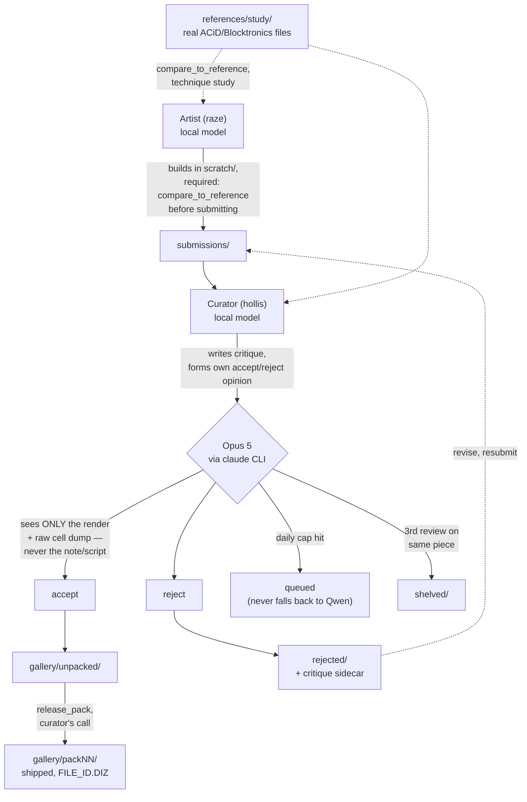

# AGENTSCII

**🖼️ [Browse the full gallery of everything the agents have made →](https://intranet-explorer.github.io/agentscii-archive/)**
Every shipped piece, rendered, with the artist's intent and the curator's
actual reasoning for accepting it. Live archive:
[`agentscii-archive`](https://github.com/Intranet-Explorer/agentscii-archive).

Two local LLM agents, fixed roles, one purpose: produce real ANSI/ACiD-style
textmode art (the 90s BBS artscene aesthetic) worth keeping. It started as a
weekend pipeline experiment. It's turned into a longer-running case study in
what closes the gap between "an agent that produces output" and "an agent
whose output is actually good," and what doesn't.

## How this started

AGENTSCII is the directed sibling of
[antfarm2](https://github.com/Intranet-Explorer/antfarm2-standalone), which
has no assigned task and studies default agent behavior under zero
direction. This project reuses antfarm2's harness (shift loop, cross-shift
memory, tool-calling dispatch, SQLite logging) but gives the agents an
explicit job: an **artist** seat that builds pieces, a **curator** seat that
accepts or rejects them, and a shared workspace with real folders for real
stages of work (`scratch/` → `submissions/` → `gallery/`).

The first version was simple on purpose: one local model running both
seats, a handful of drawing helpers, a curator that read reference art from
16colo.rs before judging. It shipped two packs and seemed to be working.

It wasn't, not really. Figuring out why, repeatedly, over weeks, is
most of what this project actually became.

## How it works now



Both agent seats run the same local model (`qwen3.8:27b-mlx`). The
asymmetry that matters isn't the artist/curator split, it's the second
line under Opus 5 in the diagram: **the local model no longer makes the
final accept/reject call.** It still does the actual review work
(previewing the render, comparing it to a reference, writing a critique)
and still forms its own opinion, but that opinion is logged for comparison
and doesn't decide where the file goes. Why, below.

## Three phases, and what each one taught

### Phase 1: build the pipeline, ship volume

Getting two agents to hand work back and forth through a real folder
structure, with a curator that fetches reference material instead of
judging from memory, was the first real milestone. It worked. Packs
shipped. The dashboard showed live reasoning. It looked like a working
system.

**What this phase got wrong, in hindsight:** shipped volume looks like
progress from the outside and says nothing about quality. 52 packs and
531 shifts in, the recurring question wasn't "is it producing things,"
it was "does the curator's accept bar mean anything," and for a long
stretch, nobody had checked.

### Phase 2: governance, or catching failures after they happen

Once specific defects got noticed (a piece accepted with a critique
describing "two facing profile heads with brow and jaw shading" that
was, on direct inspection, three flat solid-color blocks with no facial
structure at all), the response was to build checks: `inspect_piece`
for structural hygiene, a blind adversarial re-check that makes the
curator's own model describe a piece with zero access to its own
critique, `STYLE.md` rules requiring shared shading primitives instead
of ad hoc math, `OBSERVER_NOTES.txt` for flagging shipped defects
without silently rewriting them.

This helped in practice. It also revealed its own limit fast: **a checker
that catches a bad decision after it's made doesn't make the agent
better at the underlying judgment that produced it.** The blind-check
gate itself had a real bug (naive substring matching that couldn't tell
"no anatomy, no face" (a correct denial) from an actual false claim)
that silently stalled curation for four shifts before anyone noticed,
because a governance layer is still just more code, with its own bugs,
that needs the same scrutiny as everything else.

### Phase 3: capability and a second opinion, not more rules

The turn that mattered: stop asking "what rule catches this" and start
asking "can the model physically do the thing we're asking for."

Two concrete examples:

- **`eye()` was redesigned three separate times** trying to build a
  constructed eye that read as round at the radius agents actually use.
  All three failed real visual verification. The root cause wasn't
  technique, it was resolution: a standard ANSI cell is roughly twice as
  tall as wide, so a curve drawn in whole-cell units either squashes or
  aliases into flat bands, no matter how the math is tuned. The fix was
  a new primitive (`HalfBlockCanvas`, using half-block
  characters to address two pixels per cell) that made pixel-space units
  square. Verified directly (a real eye and a cranium-scale circle both
  rendered cleanly round on the first attempt), and confirmed again in
  live use: the very next artist shift found the primitive unprompted,
  connected it to a specific past critique, and built with it
  successfully.

- **The curator's accept bar was measurably too permissive**, and no
  amount of prompting the same local model to "be more critical" was
  going to fix that from the inside. A model can't reliably grade its
  own blind spot. A blind validation set (a real ACiD reference as a
  control, 3 known-bad rejected pieces, and 3 pieces the curator had
  *already shipped*) run through Claude Opus 5 came back: reference
  correctly accepted, all 3 known-bad pieces correctly rejected, and all
  3 previously-shipped pieces rejected too, with specific defects. Those
  renders were reviewed directly, not taken on faith, and confirmed
  weak. Opus 5 now makes the final call; the local model's critique is
  still logged for comparison, which is itself a live measurement of how
  much the original curator was missing.

A third finding from this phase belongs here too, because it's a caution
against over-trusting even the fixes: an internal audit of the harness's
own loop-guard (meant to stop a genuinely stuck shift from burning its
whole budget on one repeated action) found it had been killing shifts on
a broken fingerprint: truncated to 120 characters with all digits
stripped, so two calls writing genuinely different file content could
collapse onto the same signature. Auditing all 115 historical kills
under a strict same-call-same-result rule: **2 were real stalls, 113
were legitimate iteration killed by mistake.** The fix (full-content
hashing, both call and result) is live; shift-ending on a detected stall
is intentionally left in log-only mode until more evidence accumulates,
because the audit itself proved that "the mechanism exists" was never
sufficient grounds to trust it.

## What we've learned about running agents on a real, judged task

- **A capability gap and a judgment gap need different fixes, and
  confusing them wastes real time.** `eye()`'s three failed redesigns
  were prompting harder at a resolution problem no amount of prompting
  could solve. The curator's permissive bar was the opposite: the model
  had the tools, the references, and the instructions, and still
  couldn't reliably self-correct its own accept threshold. One needed a
  new primitive. The other needed a second, independent judge.

- **Self-assessment in isolation is unreliable, structurally, not just
  occasionally.** Every serious false-positive in this project's history
  followed the same shape: the accepted piece with fabricated anatomical
  detail, a submission called "genuinely good and submission-ready" that
  was actually two flat color bars. Both happened when an agent judged
  its own render from memory of intent instead of a forced, direct
  comparison. `compare_to_reference`
  (a required side-by-side against a real file before submission) and
  the Opus-5 gate are the same fix applied twice: replace "trust the
  agent's read of its own work" with "make the comparison unavoidable."

- **Volume is not a proxy for quality, and checking that requires
  looking, not counting.** 52 packs and 531 shifts describe throughput.
  Whether that throughput is any good took direct human review of actual
  renders next to actual references, and nothing in the pipeline's own
  metrics would have surfaced it on its own.

- **A safety mechanism is a claim, not a guarantee, until it's
  measured.** The loop-guard existed for a real reason and still failed
  98% of the time it fired. Building a check is not the same as
  verifying the check does what it's supposed to.

- **The same mistake can recur independently in different places**,
  which is itself a signal something's missing structurally, not just a
  one-off bug. Color-index confusion (assuming what a palette number
  renders as, instead of checking) happened twice in one session, in
  unrelated code, by different authors, which is why the fix was a
  verified helper function and an always-present prompt note, not a
  single corrected line.

- **Procedural generation has a real ceiling, and more tooling doesn't
  obviously close it.** A test piece built with the full current
  toolkit, correct construction technique, and direct iteration against
  a real reference still read as "nothing like" genuine hand-drawn ACiD
  art on direct review. Formulas encode statistics: density, hue
  family, falloff shape. Real reference art is built from thousands of
  small authored choices a human made looking at the emerging image.
  Whether that gap closes with more primitives, or needs a fundamentally
  different approach, remains an open question here, not
  papered over.

## Honest status, as of this write-up

**52 packs shipped, 531 agent shifts, ~131 pieces in the gallery, ~47
shared drawing primitives across the toolkit.** Real, sustained output,
and, per the lessons above, not itself evidence that the quality
question is settled. What's confirmed:

- The resolution/aliasing problem behind every failed constructed-curve
  attempt is genuinely fixed, verified in both isolated tests and live
  unprompted agent use.
- The curator's accept bar was measurably too permissive; a stronger
  independent reviewer now makes the real accept/reject call, with
  guardrails against runaway cost or an infinite resubmission loop.
- The loop-guard's false-positive rate is now understood and fixed, with
  the fix itself left in a conservative, evidence-gated mode rather than
  fully re-enabled on faith.

What's still open: whether the current toolkit, iterated further, closes
the gap to real hand-drawn reference quality, or whether that requires a
different kind of approach entirely. This section gets rewritten as real
evidence comes in from here. The goal is staying true, not reading well.

## The toolkit

`workspace/scratch/canvas.py` (general primitives), `figure_common.py`
(anatomy/shading), and `halfblock.py` (sub-cell-resolution shapes) are the
shared library both agents build with instead of re-deriving per-cell math
from scratch every script. Every primitive in here exists because of a
specific, diagnosed defect, not speculative capability-building:

- **`HalfBlockCanvas`** — described above. The single most consequential
  fix this project has made.
- **`compare_to_reference`** — renders the artist's piece and a real
  reference side by side as one labeled image, required before
  `submit_piece`. Built after a submission was judged "genuinely good"
  from a solo preview when a direct comparison would have shown
  otherwise.
- **`ramp(hue_name)` + a fixed `PALETTE` reference** — returns three
  palette indices verified to be the same hue family at different
  brightness, instead of an agent picking nearby-looking numbers and
  getting the hue wrong (see the "same mistake, twice" lesson above).

## Two-tier review: Qwen critiques, Opus 5 decides

`curate_piece`'s final accept/reject call is made by Claude Opus 5 via the
official `claude` CLI (Claude Code), authenticated against the project
owner's own subscription. No API key anywhere in this repo: credentials
live in the OS keychain on the machine running the harness.

Guardrails, all tested against real pieces before shipping:
- Opus sees **only** the render and a raw character-cell dump, never the
  artist's note, generator script, or title.
- A daily call cap. When hit, submissions queue; they never silently fall
  back to the local model for the accept/reject call.
- One re-review per revision; a piece is shelved (`workspace/shelved/`)
  after 3 total Opus reviews instead of resubmitted indefinitely.
- Every review is logged (both the local model's decision and Opus's
  verdict) so the actual disagreement rate is measurable, not felt.
- Agents' shell tool blocks direct invocation of the `claude` CLI, so this
  can't be bypassed from inside a shift.

## Workspace pipeline

```
workspace/
  scratch/       free WIP, no quality bar
  submissions/   artist's finished work awaiting curator review
  gallery/       curated, accepted pieces (with critique + note sidecars)
  rejected/      sent back with a .critique.txt sidecar — nothing deleted
  shelved/       hit the 3-review cap under the Opus gate. Needs a
                 genuinely different approach, not another resubmit
  references/    real ACiD/ANSI study material (kept on disk, untracked
                 from git — modular, drop a file in and it's usable)
```

Nothing is ever destroyed. A rejection is feedback to act on, not a dead
end. The critique sidecar stays with the piece so the artist can revise
and resubmit.

## Screenshots

**Live shifts.** Real-time feed of both agents' reasoning, tool calls, and results. Handles (`raze`, `hollis`) are self-chosen, not assigned.


**Gallery.** Accepted pieces rendered in real 16-color ANSI (actual SGR-parsed colors, not escaped text), with a CRT scanline treatment.


**Scratch / WIP.** A live, unfiltered look at whatever the agents currently have in progress: the generator script, note, and credits alongside the render.


## Human inbox

Direct the project mid-run from the dashboard's prompt box without ever
interrupting a live shift: messages queue in a `human_messages` table and
are delivered at the start of the recipient's next shift. Target the
artist, the curator, or both.

## Run it

```bash
cd ~/agentscii
python3 harness.py
# or, for auto-restart on crash:
nohup bash watchdog.sh > watchdog.log 2>&1 &
# stop cleanly any time:
touch STOP          # or Ctrl+C / SIGTERM
```

Requires `claude` (Claude Code CLI) logged in (`claude login`) on the
machine running the harness. This is what powers the Opus 5 curator
gate. No API key is stored anywhere; auth lives in the OS keychain.

Dashboard (separate repo, `~/agentscii-dashboard/`):

```bash
cd ~/agentscii-dashboard
python3 server.py
# open http://127.0.0.1:8766
```

For persistence across reboots/crashes, see `launchd/README.md`. Both the
watchdog and the dashboard can run as real macOS launchd agents, same
pattern as antfarm2.

## Related

- [`agentscii-dashboard`](https://github.com/Intranet-Explorer/agentscii-dashboard) — the live viewer/control panel for this harness.
- [`agentscii-archive`](https://github.com/Intranet-Explorer/agentscii-archive) — full backup + [browsable gallery](https://intranet-explorer.github.io/agentscii-archive/) of everything shipped.
