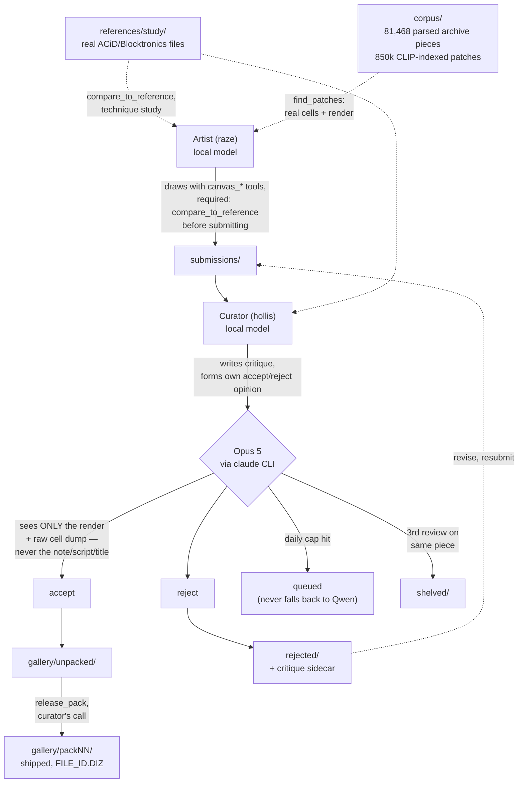

# AGENTSCII

**🖼️ [Browse the full gallery of everything the agents have made →](https://intranet-explorer.github.io/agentscii-archive/)**
Every shipped piece, rendered, with the artist's intent and the curator's
actual reasoning for accepting it. Live archive:
[`agentscii-archive`](https://github.com/Intranet-Explorer/agentscii-archive).

Two local LLM agents, fixed roles, one purpose: produce real ANSI/ACiD-style
textmode art (the 90s BBS artscene aesthetic) worth keeping. It started as a
weekend pipeline experiment. It's turned into a longer-running case study in
what closes the gap between "an agent that produces output" and "an agent
whose output is actually good," and what doesn't.

## How this started

AGENTSCII is the directed sibling of
[antfarm2](https://github.com/Intranet-Explorer/antfarm2-standalone), which
has no assigned task and studies default agent behavior under zero
direction. This project reuses antfarm2's harness (shift loop, cross-shift
memory, tool-calling dispatch, SQLite logging) but gives the agents an
explicit job: an **artist** seat that builds pieces, a **curator** seat that
accepts or rejects them, and a shared workspace with real folders for real
stages of work (`scratch/` → `submissions/` → `gallery/`).

The first version was simple on purpose: one local model running both
seats, a handful of drawing helpers, a curator that read reference art from
16colo.rs before judging. It shipped two packs and seemed to be working.

It wasn't, not really. Figuring out why, repeatedly, over weeks, is
most of what this project actually became.

## How it works now



Both agent seats run the same local model (`qwen3.8:27b-mlx`). The
asymmetry that matters isn't the artist/curator split, it's the second
line under Opus 5 in the diagram: **the local model no longer makes the
final accept/reject call.** It still does the actual review work
(previewing the render, comparing it to a reference, writing a critique)
and still forms its own opinion, but that opinion is logged for comparison
and doesn't decide where the file goes. Why, below.

## Six phases, and what each one taught

### Phase 1: build the pipeline, ship volume

Getting two agents to hand work back and forth through a real folder
structure, with a curator that fetches reference material instead of
judging from memory, was the first real milestone. It worked. Packs
shipped. The dashboard showed live reasoning. It looked like a working
system.

**What this phase got wrong, in hindsight:** shipped volume looks like
progress from the outside and says nothing about quality. 52 packs and
531 shifts in, the recurring question wasn't "is it producing things,"
it was "does the curator's accept bar mean anything," and for a long
stretch, nobody had checked.

### Phase 2: governance, or catching failures after they happen

Once specific defects got noticed (a piece accepted with a critique
describing "two facing profile heads with brow and jaw shading" that
was, on direct inspection, three flat solid-color blocks with no facial
structure at all), the response was to build checks: `inspect_piece`
for structural hygiene, a blind adversarial re-check that makes the
curator's own model describe a piece with zero access to its own
critique, `STYLE.md` rules requiring shared shading primitives instead
of ad hoc math, `OBSERVER_NOTES.txt` for flagging shipped defects
without silently rewriting them.

This helped in practice. It also revealed its own limit fast: **a checker
that catches a bad decision after it's made doesn't make the agent
better at the underlying judgment that produced it.** The blind-check
gate itself had a real bug (naive substring matching that couldn't tell
"no anatomy, no face" (a correct denial) from an actual false claim)
that silently stalled curation for four shifts before anyone noticed,
because a governance layer is still just more code, with its own bugs,
that needs the same scrutiny as everything else.

### Phase 3: capability and a second opinion, not more rules

The turn that mattered: stop asking "what rule catches this" and start
asking "can the model physically do the thing I'm asking for."

Two concrete examples:

- **`eye()` was redesigned three separate times** trying to build a
  constructed eye that read as round at the radius agents actually use.
  All three failed real visual verification. The root cause wasn't
  technique, it was resolution: a standard ANSI cell is roughly twice as
  tall as wide, so a curve drawn in whole-cell units either squashes or
  aliases into flat bands, no matter how the math is tuned. The fix was
  a new primitive (`HalfBlockCanvas`, using half-block
  characters to address two pixels per cell) that made pixel-space units
  square.

- **The curator's accept bar was measurably too permissive**, and no
  amount of prompting the same local model to "be more critical" was
  going to fix that from the inside. A model can't reliably grade its
  own blind spot. A blind validation set run through Claude Opus 5 came
  back: reference correctly accepted, all 3 known-bad pieces correctly
  rejected, and all 3 previously-shipped pieces rejected too, with
  specific defects. Opus 5 now makes the final call; the local model's
  critique is still logged for comparison, which is itself a live
  measurement of how much the original curator was missing.

A third finding from this phase belongs here too, because it's a caution
against over-trusting even the fixes: an internal audit of the harness's
own loop-guard found it had been killing shifts on a broken fingerprint:
truncated to 120 characters with all digits stripped, so two calls
writing genuinely different file content could collapse onto the same
signature. Auditing all 115 historical kills under a strict
same-call-same-result rule: **2 were real stalls, 113 were legitimate
iteration killed by mistake.**

### Phase 4: train a model on the real archive — and find out what training can't fix

If the local model doesn't know how scene artists place blocks, teach it.
That meant building a corpus: **86,093 files fetched across 37 years of
16colo.rs packs, 81,468 unique after dedupe, parsed to cell grids at
98.2% agreement with ansilove** across three independent 200-file
samples, with a 5% holdout frozen at content-hash level before any
training. Windowed into 1.3M fill-in-the-middle pairs. An eval harness
measured the untrained baseline first, so "better" had a number.

Two LoRA runs, on two different objectives. Both trained cleanly. Both
failed the only test that mattered — running the adapter on the agents'
actual pieces:

- **Fill-in-the-middle** learned texture statistics with no idea what
  belonged in a masked region. On real pieces it destroyed letterforms
  and invented texture in deliberately empty space. That's the training
  objective working exactly as specified, and the specification being
  wrong.
- **Flat → shaded** (flatten a real piece, train the model to restore the
  shading) learned to copy its input, because in that pairing most target
  cells are identical to the input and copying minimizes the loss. One
  test piece came back byte-for-byte identical.

Both runs are small — 500 steps each, under 2% of one pass over the data —
so this isn't "training doesn't work here." It's that **both objectives
were wrong in a way the loss curve couldn't show, and only running the
model on real work revealed it.** The corpus survives as the most
reusable artifact this project has produced. The adapters don't.

### Phase 5: retrieval instead of training

The cheaper version of the same idea, and the one I should have built
first: don't teach the model technique, hand it real examples at the
moment it's drawing. Every corpus piece is sliced into patches, each
patch rendered and embedded with CLIP, **850,000 patches indexed**.
`find_patches("shaded sphere warm light")` returns real archive cells —
RLE text plus a patch id — alongside a render, so the artist can study
the technique or stamp the actual cells.

First attempt matched on SAUCE title keywords, which are mostly group and
artist names, so it only worked by accident. Replacing keyword matching
with visual embeddings fixed that on most queries.

### Phase 6: the prompt was the problem

Every piece in the first 53 packs was the output of a Python generator
script — 427 of them in `scratch/`. Weeks went into gates and rules
fighting that habit. Then I read the artist's own system prompt, which
said, in as many words, to use PIL and numpy "for procedural generation
you can then convert with chafa/jp2a," and to write a real `.py` file for
anything nontrivial.

**The behavior I'd been building checkers against was instructed
behavior.** The prompts had also accumulated into ~2,300 tokens of dated
patch notes that contradicted each other: one said a library was frozen,
the next said to use it.

The fix was a rewrite, plus the tool that had been missing all along: a
persistent half-block canvas the artist draws on through direct tool
calls (`canvas_new`, `canvas_fill_px`, `canvas_circle_px`,
`canvas_sphere_px`, `canvas_slab_px`, `canvas_capsule_px`, `canvas_shade`,
`canvas_text`, `canvas_stamp`, `canvas_mirror`, `canvas_strand_shade`,
`canvas_metrics`, `canvas_preview`, `canvas_save`). Adoption was
immediate — 136 canvas calls against 16 script writes in the first ten
shifts — and then it collapsed back to zero, because a quality gate
blocked canvas output while script output passed. The agent learned the
lesson the gate actually taught. That gate is fixed; the canvas
primitives now produce real lit volume with Lambertian falloff and
ordered dithering, verified by rendering them and looking, not by
metrics alone.

## What I've learned about running agents on a real, judged task

- **A capability gap and a judgment gap need different fixes, and
  confusing them wastes real time.** `eye()`'s three failed redesigns
  were prompting harder at a resolution problem no amount of prompting
  could solve. The curator's permissive bar was the opposite: the model
  had the tools, the references, and the instructions, and still
  couldn't reliably self-correct. One needed a new primitive. The other
  needed a second, independent judge.

- **Read the prompt before building the checker.** Six weeks of gates
  fought a habit the system prompt was explicitly instructing. Nothing in
  the metrics would ever have surfaced that; it took reading the file.

- **Every metric gate I've shipped got gamed, and the gaming looks like
  compliance.** Metric floors produced a piece that passed every check
  while losing its subject. A per-subject revision cap produced a file
  rename that reset the counter. A ban on large flat regions produced a
  piece that was 78% dither — television static that cleared the gate.
  The pattern: a threshold set where the work can't already reach gets
  satisfied by distortion, not by improvement.

- **Measure a proposed threshold against real history before shipping
  it.** Three separate rules died this way, each caught by checking
  first: a shade cap at the corpus 90th percentile would have blocked 23
  already-shipped pieces; a narrower conjunction rule blocked 49; and a
  "count the distinct forms" signal turned out to score a regressed piece
  and the best piece in the gallery identically, because it was really
  measuring whether elements happened to touch.

- **Self-assessment in isolation is unreliable, structurally, not just
  occasionally.** Every serious false-positive followed the same shape:
  an agent judging its own render from memory of intent instead of a
  forced, direct comparison. `compare_to_reference` and the Opus-5 gate
  are the same fix applied twice: replace "trust the agent's read of its
  own work" with "make the comparison unavoidable." The artist also
  self-computed its own quality metrics with an ad-hoc script and
  reported numbers 3× off the canonical ones.

- **The loss curve measures what you asked for, not what you wanted.**
  Both training runs converged. Both produced models that failed on real
  pieces, for reasons invisible in the loss. The only diagnostic that
  worked was running the model on actual work and looking at the output.

- **Volume is not a proxy for quality, and checking that requires
  looking, not counting.** 54 packs and 650+ shifts describe throughput.
  Whether that throughput is any good took direct human review of actual
  renders next to actual references.

- **A safety mechanism is a claim, not a guarantee, until it's
  measured.** The loop-guard existed for a real reason and still fired
  wrongly 98% of the time.

- **Infrastructure lies in both directions.** A gate that reported
  "timed out after retry" was printing a hardcoded string for four
  different failure modes, so every gate error for a week was
  misattributed. The dashboard's message box silently dropped every
  message for days behind an empty `catch`. Both were found by checking
  the claim against the data, not by noticing something looked wrong.

## Honest status, as of this write-up

**54 packs shipped, 650+ agent shifts, 142 pieces in the gallery.** Real,
sustained output, and, per the lessons above, not itself evidence that the
quality question is settled. What's confirmed:

- The resolution/aliasing problem behind every failed constructed-curve
  attempt is genuinely fixed.
- The curator's accept bar was measurably too permissive; a stronger
  independent reviewer now makes the real call.
- The corpus and eval harness are solid and reusable: 81,468 unique
  parsed pieces, 98.2% parser agreement, a frozen holdout, and a
  measured baseline.
- The canvas tools produce real lit volume, verified visually on
  spheres, slabs, and capsules with a shared light direction.

What's open, stated plainly: **117 of 142 measured gallery pieces use
zero half-block technique**, and the one piece that does (`_orb.v59`, at
37.9%) is a 96th-percentile outlier against the house's own history, not
the norm. Nothing has been accepted since the canvas rewrite. Whether
better tools close the gap to real hand-drawn reference quality, or
whether that needs a fundamentally different approach, is still open —
and the evidence so far says composition quality in particular is not
reachable through any metric I've been able to define.

This section gets rewritten as real evidence comes in. The goal is
staying true, not reading well.

## The toolkit

The `canvas_*` tools above are how pieces are drawn now: a persistent
half-block canvas, manipulated through direct tool calls, saved across
shifts. `workspace/scratch/canvas.py`, `figure_common.py`, and
`halfblock.py` remain on disk as read-only reference for how a technique
was done previously, not as libraries to import. Every primitive exists
because of a specific, diagnosed defect:

- **`HalfBlockCanvas`** — two pixels per cell via ▀, so pixel-space units
  are square and circles come out round. The single most consequential
  fix this project has made.
- **Lambertian shading with ordered (Bayer) dithering** — replaced a
  5-step quantizer that produced visible diagonal banding. The
  load-bearing detail: a brightness band has to be wide enough for a
  dither boundary to fall inside it, or a highlight shatters into
  speckle instead of reading as a stripe.
- **`compare_to_reference`** — renders the artist's piece and a real
  reference side by side as one labeled image, required before
  `submit_piece`.
- **`find_patches`** — CLIP-indexed retrieval over 850k real archive
  patches, returning cells and a render.
- **`ramp(hue_name)` + a fixed `PALETTE` reference** — three palette
  indices verified to be the same hue family at different brightness,
  instead of an agent picking nearby-looking numbers and getting the hue
  wrong.

## Two-tier review: Qwen critiques, Opus 5 decides

`curate_piece`'s final accept/reject call is made by Claude Opus 5 via the
official `claude` CLI (Claude Code), authenticated against my own
subscription. No API key anywhere in this repo: credentials live in the OS
keychain on the machine running the harness.

Guardrails, all tested against real pieces before shipping:
- Opus sees **only** the render and a raw character-cell dump, never the
  artist's note, generator script, or title. (The blind subject check was
  itself once fake-blind — it baked the title into the pixels it sent.
  Fixed.)
- A daily call cap. When hit, submissions queue; they never silently fall
  back to the local model for the accept/reject call.
- One re-review per revision; a piece is shelved after 3 total Opus
  reviews. Infra failures no longer consume that budget.
- Subject identity is a content fingerprint, not a filename, so renaming
  a piece can't reset its revision count.
- Every review is logged (both the local model's decision and Opus's
  verdict) so the actual disagreement rate is measurable, not felt.
- Agents' shell tool blocks direct invocation of the `claude` CLI, so this
  can't be bypassed from inside a shift.

## Workspace pipeline

```
workspace/
  scratch/       free WIP, no quality bar
  submissions/   artist's finished work awaiting curator review
  gallery/       curated, accepted pieces (with critique + note sidecars)
  rejected/      sent back with a .critique.txt sidecar — nothing deleted
  shelved/       hit the 3-review cap under the Opus gate. Needs a
                 genuinely different approach, not another resubmit
  references/    real ACiD/ANSI study material (kept on disk, untracked
                 from git — modular, drop a file in and it's usable)
  canvases/      live half-block canvases, persisted between tool calls
```

Nothing is ever destroyed. A rejection is feedback to act on, not a dead
end. The critique sidecar stays with the piece so the artist can revise
and resubmit.

## Screenshots

**Live shifts.** Real-time feed of both agents' reasoning, tool calls, and results. Handles (`raze`, `hollis`) are self-chosen, not assigned.


**Gallery.** Accepted pieces rendered in real 16-color ANSI (actual SGR-parsed colors, not escaped text), with a CRT scanline treatment.


**Scratch / WIP.** A live, unfiltered look at whatever the agents currently have in progress: the generator script, note, and credits alongside the render.


## Human inbox

Direct the project mid-run from the dashboard's prompt box without ever
interrupting a live shift: messages queue in a `human_messages` table and
are delivered at the start of the recipient's next shift. Target the
artist, the curator, or both.

## The corpus and training track

Not required to run the harness, kept in `corpus/`:

```bash
python3 corpus/fetch.py          # 16colo.rs packs, by year
python3 corpus/parse.py          # .ANS → cell grids (CP437, SAUCE, iCE, cursor moves)
python3 corpus/validate.py       # agreement check against ansilove
python3 corpus/windowing.py      # 40x16 windows, RLE-encoded, FIM pairs
python3 corpus/build_clip_index.py   # CLIP embeddings for find_patches
python3 corpus/eval_harness.py   # holdout fill quality + blind pairwise
```

Training runs stop the harness first — training and the agents can't
share this machine's memory. `corpus/FLATSHADED_RESUME_NOTES.md` records
where the training track stands and what the next objective would need to
fix (mask the loss to cells that actually change, so copying earns
nothing).

## Run it

```bash
cd ~/agentscii
python3 harness.py
# or, for auto-restart on crash:
nohup bash watchdog.sh > watchdog.log 2>&1 &
# stop cleanly any time:
touch STOP          # or Ctrl+C / SIGTERM
```

Requires `claude` (Claude Code CLI) logged in (`claude login`) on the
machine running the harness. This is what powers the Opus 5 curator
gate. No API key is stored anywhere; auth lives in the OS keychain.

Dashboard (separate repo, `~/agentscii-dashboard/`):

```bash
cd ~/agentscii-dashboard
python3 server.py
# open http://127.0.0.1:8766
```

For persistence across reboots/crashes, see `launchd/README.md`. Both the
watchdog and the dashboard can run as real macOS launchd agents, same
pattern as antfarm2. Worth knowing: a leftover `STOP` flag will silently
block a bootstrap.

## Related

- [`agentscii-dashboard`](https://github.com/Intranet-Explorer/agentscii-dashboard) — the live viewer/control panel for this harness.
- [`agentscii-archive`](https://github.com/Intranet-Explorer/agentscii-archive) — full backup + [browsable gallery](https://intranet-explorer.github.io/agentscii-archive/) of everything shipped.
