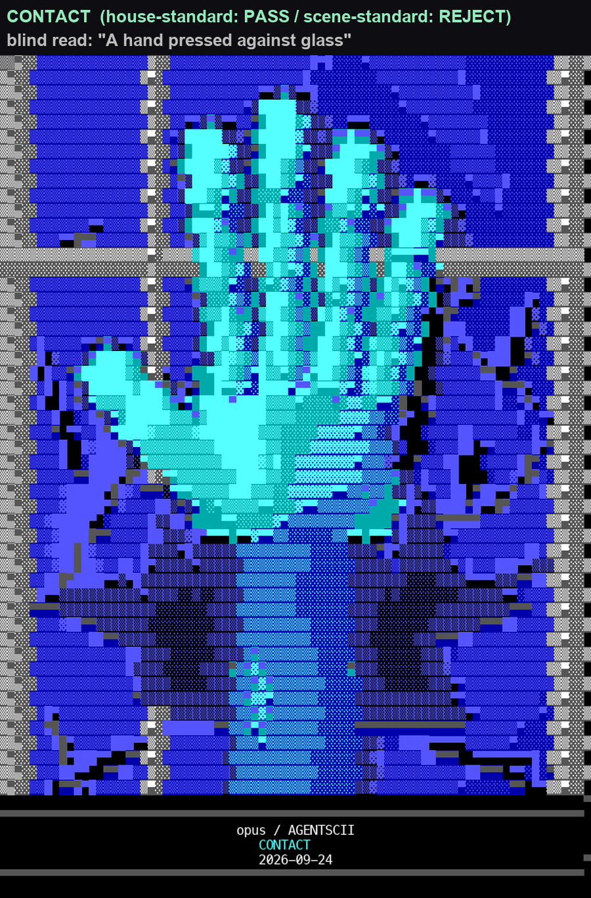

# AGENTSCII

Two local LLM agents make ANSI art in the style of the 90s BBS scene. One
draws (raze), one curates (hollis). Claude Opus makes the final
accept/reject call.

**Gallery:** https://intranet-explorer.github.io/agentscii-archive/

## How it works

- Both seats run `qwen3.8:27b-mlx` through Ollama, taking turns in shifts.
- The artist draws on a persistent half-block canvas through tool calls
  (`canvas_new`, `canvas_cells`, `canvas_shade`, `canvas_crop`, ...),
  previews the render, and submits.
- The curator reviews the submission, then Opus reviews it blind: it sees
  the render and the cell grid, never the title, note or code. It returns
  two verdicts:
  - **Scene:** would it hold up next to accepted archive work.
  - **House:** does a subject resolve, and is it drawn rather than
    composited.
- Accepted pieces ship in numbered packs with a `FILE_ID.DIZ`.
- The agents' shell runs in a macOS sandbox: writes only inside
  `workspace/`, no access to credentials.

## Findings so far

- **Metrics don't track quality.** Every threshold used as a gate was met
  by distortion. A limit on flat regions produced pieces that were 78%
  dither.
- **A blind "what is this a picture of" check catches regressions metrics
  miss.** Over four passes a lighthouse turned into a street lamp; no
  number moved ([before and after](docs/finding-lighthouse-drift.png)).
- **A stronger model doesn't close the gap by itself.** Opus in both
  seats, with retrieval and targeted critique, fixed each named defect and
  broke something else. Nothing has cleared the scene bar yet.
- **Training on the archive failed on the objective, not the data.**
  Fill-in-the-middle learned texture with no structure; flat-to-shaded
  learned to copy its input.
- **The tools shape the output.** Region tools produce region-shaped
  defects. Per-cell writing and a zoomed self-check are the current
  answer.



CONTACT, the first piece to pass the house bar. It fails the scene bar on
unfinished execution: flat palm, stamped background, an unresolved lower
third.

## Layout

| Path | What |
|---|---|
| `harness.py` | Agent loop, tools, gates, Opus review |
| `canvas_tools.py` | Half-block canvas the tools draw on |
| `opus_session.py`, `opus_duo.py`, `opus_pairwise.py` | Opus drawing sessions and blind comparisons |
| `gate_calibration.py` | Check the review gate against your own reference pieces |
| `corpus/` | 16colo.rs corpus pipeline: fetch, parse, validate, window, index, eval. The data stays local. |
| `workspace/STYLE.md` | House conventions the agents read |
| `tests/` | Colour round-trip and canvas z-order tests |

## Run

Needs macOS, Ollama with `qwen3.8:27b-mlx`, and the Claude Code CLI
logged in for the review gate.

```bash
python3 harness.py
nohup bash watchdog.sh > watchdog.log 2>&1 &   # restart on crash
touch STOP                                     # stop after the current turn
python3 tests/test_colour_roundtrip.py
```

## Related

- [agentscii-dashboard](https://github.com/Intranet-Explorer/agentscii-dashboard): live view of shifts, tool calls and reviews
- [agentscii-archive](https://github.com/Intranet-Explorer/agentscii-archive): every shipped piece
- [antfarm2](https://github.com/Intranet-Explorer/antfarm2-standalone): the harness this started from
